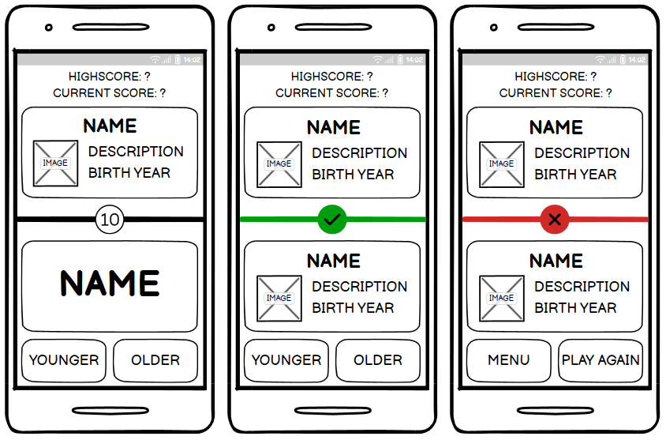
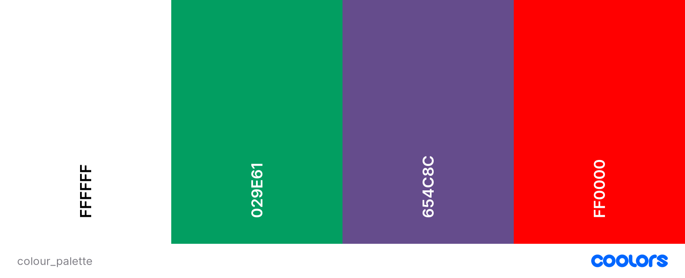
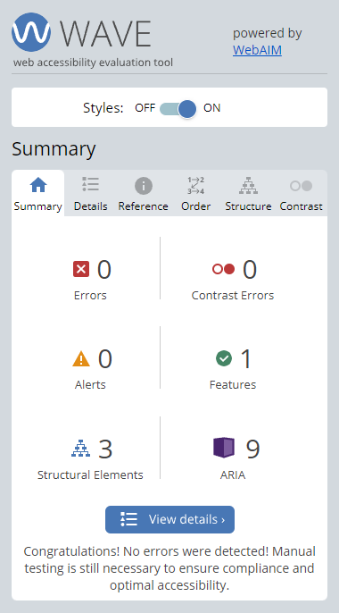
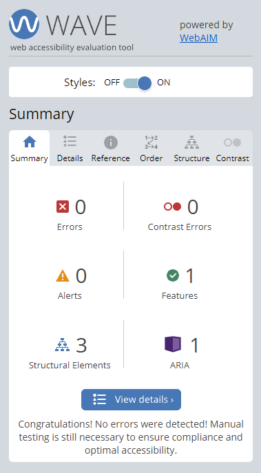
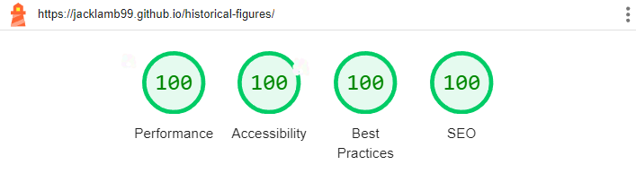
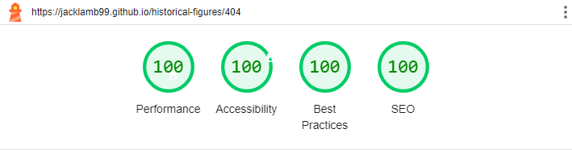
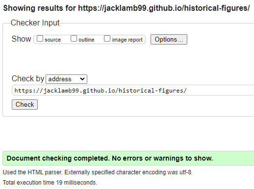
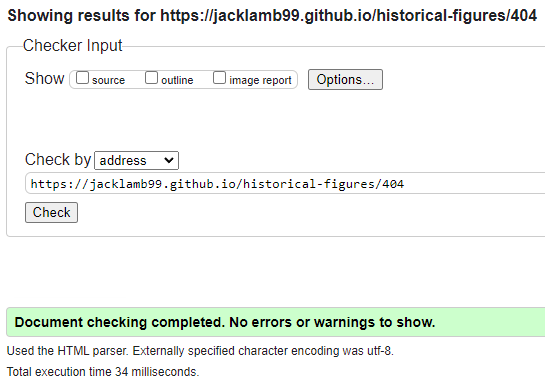
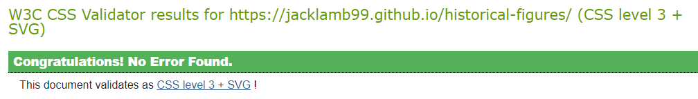
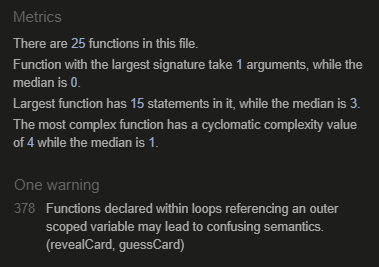

# Historical Figures

'Historical Figures' is an engaging trivia game that challenges players' knowledge of historical figures from various ages and cultures. From renowned leaders to influential inventors, every correct answer brings players closer to becoming a true historical virtuoso. View the live site [here](https://jacklamb99.github.io/historical-figures/)

## Table of Contents

* [Features](#features)
    * [Menu Page](#menu-page)
    * [Instructions Page](#instructions-page)
    * [Game Page - Active Game](#game-page---active-game)
    * [Game Page - Correct Answer](#game-page---correct-answer)
    * [Game Page - Incorrect Answer](#game-page---incorrect-answer)
    * [404 Page](#404-page)
    * [Existing Features](#existing-features)
    * [Possible Future Features](#possible-future-features)
* [Design](#design)
    * [Wireframe](#wireframe)
    * [Imagery](#imagery)
    * [Typography](#typography)
    * [Background & Colour Palette](#background--colour-palette)
* [Technologies](#technologies)
* [Testing](#testing)
    * [Responsiveness](#responsiveness)
    * [Accessibility](#accessibility)
    * [Lighthouse Testing](#lighthouse-testing)
    * [Functional Testing](#functional-testing)
    * [Validator Testing](#validator-testing)
    * [Unfixed Bugs](#unfixed-bugs)
* [Deployment](#deployment)
    * [Version Control](#version-control)
    * [Deployment to GitHub Pages](#deployment-to-github-pages)
    * [Clone the Repository Code Locally](#clone-the-repository-code-locally)
* [Credits](#credits)
    * [Guidance](#guidance)
    * [Content](#content)
    * [Media](#media)
    * [Code Used](#code-used)
    * [Acknowledgement](#acknowledgement)

## Features

### Menu Page

* A simple but aesthetically pleasing menu introduces users to the 'Historical Figures' game.
* The primary function buttons are placed in the middle of the page to instantly attract the users' attention.
* The "Instructions" button is placed first to encourage users to open this page before starting the game.

### Instructions Page

* Clicking the "Instructions" button will display the instructions page.
* The instructions are clearly laid out and thoroughly explained so that users can get a good understanding of the content of the game before even opening it.
* The return arrow icon is large enough to be easily noticed and is placed in the top-left corner, following a universal position for return buttons and so making its function clear and understandable.

### Game Page - Active Game

* Clicking the "Play" button will display the game page and automatically start a new game.
* Users will then have 10 seconds, which counts down in the centre of the page, to submit an answer.
* The "Younger" and "Older" answer submission buttons are placed directly under the bottom card, which makes it clear that they must compare that historical figure to the one above.
* The "is…" text was an addition made after an initial round of user feedback to reinforce the aim of the game, by forming a "This figure is younger/older" statement in the users' head when coupled with the buttons directly below.

### Game Page - Correct Answer

* Submitting a correct answer will display the full details of the figure bottom card, allowing the user to make a comparison between the two if desired.
* The page divider will change to a shade of green and display a 'check' icon in place of the timer to clearly indicate that the answer was correct.
* The "Score" counter at the top of the page will increment by 1 point after each correct answer, allowing the user to keep track throughout the game.
* The "High Score" is stored locally on the user's device and will update to match the "Score" when a new high score is set. This feature aims to encourage users to return to the game in order to beat their own score and even share the game with others to challenge them to do the same.

### Game Page - Incorrect Answer

* Submitting an incorrect answer will also display the full details of the figure on the bottom card, allowing the users to make a comparison between the two and understand why they were wrong.
* Revealing the card even when the wrong answer is submitted allows users to learn more about the figure, aiming to encourage them to play again with their newfound knowledge as they now stand a better chance of answering correctly if the figure appears again.
* The "Menu" and "Play Again" buttons allow for clear and straightforward navigation, the latter of which will automatically randomise the two figure cards, reset the score and start the timer again.

### 404 Page

* A simple 404 page allows users to navigate to the menu through a simple and eye-catching button, without having to do any extra typing or browser operations.
* Including the 'Historical Figures' name and following the same styles as the main site aims to inform users that they are on the right track and discourages them from leaving out of frustration.

### Existing Features

* Clearly structured and easily navigable pages
* Straightforward interactive elements, all of which provide feedback through hover effects
* A custom 404 page to reassure users
* Responsive design

### Possible Future Features

* Styles for a "dark mode" could be added and toggled with an animated button to allow users more control over the site's aesthetic.
* More figures could be added to bridge the large time gaps between some of the current figures.
* A difficulty setting could be implemented with lesser-known figures to challenge the more historically knowledgeable users.

## Design

### Wireframe

### Imagery

The images used for each figure, be it a painting, statue or photograph, allow the users a more memorable way of recalling the figures when making their guesses.

### Typography

* The 'Galada' font from Google Fonts used for the ‘Historical Figures’ header is inspired by the more cursive handwriting style that represents historical ages in modern media.
* The 'Rubik' font from Google Fonts is clear and simple to allow users to easily read necessary information quickly if required by the game's fast-paced nature.

### Background & Colour Palette

* The background is inspired by ancient Greek patterns and allows for an aesthetically pleasing appearance without distracting from the content of the site or causing a problem for more visually impaired users.
* The violet colour used for the text, buttons and more prominent design elements is more appealing than a standard monotone colour but doesn’t distract or cause visual issues. The shade used is also an exact combination of the green and red shades used in the 'Historical Figures' header.

## Technologies

The following technologies were used in the creation of the website:

HTML - The structure of the website was developed using HTML

CSS - The website was styled using custom CSS in an external file

JavaScript - The interactive elements and game logic were developed using custom JavaScript in an external file

[Visual Studio Code](https://code.visualstudio.com/) - The website was developed using the Visual Studio Code desktop application

[GitHub](https://github.com/) - The source code is hosted on GitHub and deployed using Git Pages

Git - Used to commit and push code during the development of the website

[Balsamiq](https://balsamiq.com/wireframes/desktop/) - The wireframe was created using the Balsamiq desktop application

[Google Fonts](https://fonts.google.com/) - Used to find and import the 'Galada' and 'Rubik' fonts used throughout the website

[Favicon.io](https://favicon.io/) - Used to find and import the hourglass favicon

[Font Awesome](https://fontawesome.com/) - Used to find and import all icons used throughout the website

[Pixelied]( https://pixelied.com/) - Used to convert the images used in the website to WEBP format

[Tinify](https://tinypng.com/) - Used to compress the images to reduce file sizes for improved performance

## Testing

### Responsiveness

The site was tested using Google Chrome, Microsoft Edge, Opera and Mozilla Firefox browsers to ensure responsiveness on screen sizes from 320px and upwards as defined in [WCAG 2.1 Reflow](https://www.w3.org/WAI/WCAG21/Understanding/reflow.html) criteria for responsive design.

Steps to test:

1. Open the selected browser and navigate to the 'Historical Figures' website
2. Open the developer tools to inspect
3. Set the width to responsive at 320px
4. Set the zoom to 50% to fit the larger screen sizes
5. Click and drag the width toggle at the side of the page to maximum width

The website was also opened on the following devices and no responsive issues were observed:

* Samsung Galaxy S20
* Apple iPhone 12
* Apple iPad Air
* Google Chromebook

### Accessibility

[Wave Accessibility](https://wave.webaim.org/) tool was used to ensure the website met the needs of visually impaired users:

### Lighthouse Testing

The 'Lighthouse' extension on Google DevTools was used to test the overall functionality and performance of the website:

### Functional Testing

#### Test 1 - Opening the instructions page

Action:

* Click the "Instructions" button

Expectation:

* The instructions page will be displayed

Result:

* Performed as expected, no errors occurred

https://github.com/JackLamb99/historical-figures/assets/155441638/55a905d3-93aa-4354-b11e-d4507e0990cc

#### Test 2 - Returning to the menu page

Action:

- Click the return arrow icon on the instructions page

Expectation:

- The menu page will be displayed

Result:

- Performed as expected, no errors occurred

https://github.com/JackLamb99/historical-figures/assets/155441638/b44c5720-9ca2-4f4e-9823-643ff92eeac9

#### Test 3 - Opening the game page

Action:

* Click the "Play" button

Expectation:

* The game page will be displayed 
* The full details of a random figure will be displayed on the top card
* The name of another random figure and "is..." will be displayed on the bottom card
* The timer will start counting down from 10 seconds

Result:

* Performed as expected, no errors occurred

https://github.com/JackLamb99/historical-figures/assets/155441638/8137bd85-69cc-4769-9ba1-30e39d684adb

#### Test 4 - Submitting a correct answer

Action:

* Click the correct answer button, either "Younger" or "Older"

Expectation:

* The bottom card will display the full details of the current figure
* The divider will change to a green colour and display a 'check' icon in place of the timer
* After 1.5 seconds; The bottom card will replace the top card
* The name of a random figure and "is..." will be displayed on the bottom card
* The divider will change back to its original colour and display the timer
* The timer will start counting down from 10 seconds

Result:

* Performed as expected, no errors occurred

https://github.com/JackLamb99/historical-figures/assets/155441638/80a9458b-bfc9-4ade-83d5-9ee4c64b766d

#### Test 5 - Submitting an incorrect answer

Action:

* Click the incorrect answer button, either "Younger" or "Older"

Expectation:

* The bottom card will display the full details of the current figure
* The divider will change to a red colour and display an 'X' icon in place of the timer
* The "Younger" button will be replaced by the "Menu" button
* The "Older" button will be replaced by the "Play Again" button

Result:

* Performed as expected, no errors occurred

https://github.com/JackLamb99/historical-figures/assets/155441638/6a9a1414-0c84-47d4-8711-3164960b12d0

#### Test 6 - Reaching the time limit

Action:

* Wait for the 10-second timer to end

Expectation:

* The divider will change to a red colour and display an 'X' icon in place of the timer
* The "Younger" button will be replaced by the "Menu" button
* The "Older" button will be replaced by the "Play Again" button

Result:

* Performed as expected, no errors occurred

https://github.com/JackLamb99/historical-figures/assets/155441638/2410d0da-3e81-43b3-93b2-837069c897f8

#### Test 7 - Incrementing the scores

Actions:

* Click the correct answer button, either "Younger" or "Older" (repeat 6 times)
* Click the incorrect answer button, either "Younger" or "Older"

Expectation:

* The "Score" will increase by 1 after each correct answer submission
* After 3 correct answer submissions; the "High Score" (currently "3") will increase by 1 after each correct answer submission to match the current "Score"
* After the incorrect answer submission; the "Score" and "High Score" will remain as "6"

Result:

* Performed as expected, no errors occurred

https://github.com/JackLamb99/historical-figures/assets/155441638/bfe77e42-57db-46eb-81ce-96d32d11e569

#### Test 8 - Playing the game again

Action:

* Click the "Play Again" button

Expectation:

* The full details of a random figure will be displayed on the top card
* The name of another random figure and "is..." will be displayed on the bottom card
* The divider will change back to its original colour and display the timer
* The timer will start counting down from 10 seconds
* The "Score" will be reset to "0"
* The "High Score" will remain unchanged

Result:

* Performed as expected, no errors occurred

https://github.com/JackLamb99/historical-figures/assets/155441638/fa57ecd6-4e57-4938-89f3-87a7eede18a4

#### Test 9 - Returning to the menu page

Action:

* Click the "Menu" button

Expectation:

* The menu page will be displayed
* The "High Score" will be "6" (matching the new "High Score" set on the game page)

Result:

* Performed as expected, no errors occurred

https://github.com/JackLamb99/historical-figures/assets/155441638/8072891a-ccb8-42af-a1aa-3b964257886b

#### Test 10 - Opening the Historical Figures GitHub repository

Action:

* Click the GitHub logo icon

Expectation:

* The Historical Figures GitHub repository will open in a new tab

Result:

* Performed as expected, no errors occurred

https://github.com/JackLamb99/historical-figures/assets/155441638/28eabfb8-40b6-4731-aa6f-938b9e47b954

### Validator Testing

#### HTML

No errors occurred when passing each page through the official [W3C Markup Validation Service](https://validator.w3.org/)

#### Index Page

#### 404 Page

#### CSS

No errors occurred when passing through the official [W3C CSS Validation Service](https://jigsaw.w3.org/css-validator/)

#### JavaScript

Only one "warning" occurred when passing through the [JSHint JavaScript Validation Service](https://jshint.com/), however, it does not affect the code and appears semantically sound

### Unfixed Bugs

When submitting an answer through the "Younger" / "Older" buttons, users can "spam" click a button multiple times, which causes the game to trigger the next round multiple times and eventually crash the game. This bug can be easily fixed by refreshing the page and does not cause any lasting issues. I was unable to resolve this bug on time but will attempt to resolve it in a future release.

## Deployment

### Version Control

The website was developed using the [Visual Studio Code](https://code.visualstudio.com/) desktop application and pushed to the remote repository [historical-figures](https://github.com/JackLamb99/historical-figures) on [GitHub](https://github.com/).

The following git commands were used throughout its creation to push code to the remote repository:

* `git add file` or `git add .` - This command was used to add the file(s) to the staging area before they were committed.
* `git commit –m "commit message"` - This command was used to commit changes to the local repository queue.
* `git push` - This command was used to push all committed code to the remote repository on GitHub.

### Deployment to GitHub Pages

The site was deployed to GitHub Pages, the steps to deploy are as follows:

1. In the GitHub repository, navigate to the 'Settings' tab
2. Select the 'Pages' option from the menu to the left
3. Under 'Branch', in the 'Build and deployment' section, select the 'main' dropdown option
4. Click 'Save'
5. Refresh the page and the live link will be displayed at the top of the page when published successfully

The live link can be found here - https://github.com/JackLamb99/historical-figures

### Clone the Repository Code Locally

Open the selected GitHub repository you want to clone locally:

1. Click on the 'Code' drop-down button
2. Click on the 'HTTPS' option
3. Copy the repository link
4. Open your IDE
5. Type `git clone copied-URL` into the IDE terminal (Git must be installed for this step)

## Credits

### Guidance

This [MDN Web Docs Guide](https://developer.mozilla.org/en-US/docs/Web/API/Window/localStorage) was used to understand and implement the localStorage property used for storing the "High Score" on the users' device

### Content

The description and birth year for each figure are based on information provided by the Knowledge Graph, Google's collection of information about people, places and things.

### Media

All images used in the website were found on [Wikimedia Commons](https://commons.wikimedia.org/wiki/Main_Page) and are free to use

The image used for the background pattern was found on [Toptal](https://www.toptal.com/designers/subtlepatterns/spikes-pattern/) and is free to use

### Code Used

* Favicon - The code used within the head of the HTML files to import the hourglass favicon was copied from the [Favicon Website](https://favicon.io/emoji-favicons/hourglass-done/)
* Font Awesome - The script code used within the head of the HTML files to import the Font Awesome icons was provided in my kit on the [Font Awesome Website](https://fontawesome.com/kits)
* Google Fonts - The import URL for the 'Galada' and 'Rubik' fonts was copied from the [Google Fonts Website](https://fonts.google.com/)

### Acknowledgement

[Gareth McGirr](https://github.com/Gareth-McGirr) - My Code Institute mentor
