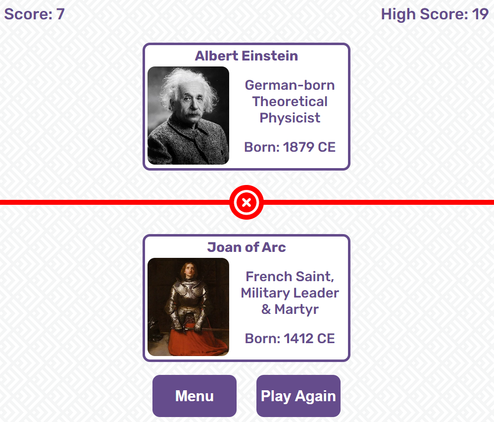

# Historical Figures

'Historical Figures' is an engaging trivia game that challenges players' knowledge of historical figures from various ages and cultures. From renowned leaders to influential inventors, every correct answer brings players closer to becoming a true historical virtuoso.

## Features

### Menu Page

* A simple but aesthetically pleasing menu introduces users to the 'Historical Figures' game.
* The primary function buttons are placed in the middle of the page to instantly attract the users' attention.
* The "Instructions" button is placed first to encourage users to open this page before starting the game.

### Instructions Page

* Clicking the "Instructions" button will display the instructions page.
* The instructions are clearly laid out and thoroughly explained so that users can get a good understanding of the content of the game before even opening it.
* The return arrow icon is large enough to be easily noticed and is placed in the top-left corner, following a universal position for return buttons and so making its function clear and understandable.

### Game Page - Active Game

* Clicking the “Play” button will display the game page and automatically start a new game.
* Users will then have 10 seconds, which counts down in the centre of the page, to submit an answer.
* The “Younger” and “Older” answer submission buttons are placed directly under the bottom card, which makes it clear that they must compare that historical figure to the one above.
* The “is…” text was an addition made after an initial round of user feedback to reinforce the aim of the game, by forming a “This figure is younger/older” statement in the users’ head when coupled with the buttons directly below.

### Game Page - Correct Answer

* Submitting a correct answer will display the full details of the figure bottom card, allowing the user to make a comparison between the two if desired.
* The page divider will change to a shade of green and display a ‘check’ icon in-place of the timer so clearly indicate that the answer was correct.
* The “Score” counter at the top of the page will increment by 1 point after each correct answer, allowing the user to keep track throughout the game.
* The “High Score” will is stored locally to the users’ device and will update to match the “Score” when a new high score is set. This feature aims to encourage users to return the game in order to beat their own score and even share the game with others to challenge them to do the same.

### Game Page - Incorrect Answer

* Submitting an incorrect answer will also display the full details of the figure on the bottom card, allowing the users to make a comparison between the two and understand why they were wrong.
* Revealing card even when the wrong answer is submitted allows users to learn more about the figure, aiming to encouraging them to play again with their newfound knowledge as they now stand a better chance of answering correctly if the figure appears again.
* The “Menu” and “Play Again” buttons allow for clear and straightforward navigation, the latter of which will automatically randomise the two figure cards, reset the score and start the timer again.

### 404 Page

* A simple 404 page allows users to navigate to the menu through a simple and eye-catching button, without having to do any extra typing or browser operations.
* Including the ‘Historical Figures’ name and following the same styles of the main site aims to inform users that they are on the right track and discourages them from leaving out of frustration.

